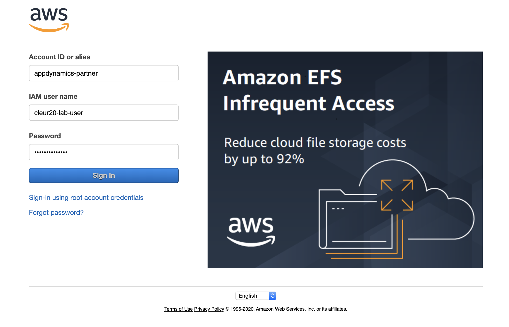

# Lab Exercise 1
## Login to the AWS Console and Locate Your Lab EC2 Instance.
### (e.g. Launch Pad EC2)

The Launch Pad EC2 instance is used to execute all the steps needed for the configuration and management of the Kubernetes (AWS EKS) cluster. It comes pre-installed with utilities like AWS CLI, kubectl, eksctl, etc.

In this exercise you will use the **AWS Management Console** to locate your Lab EC2 instance that will be used to clone two GitHub repositories and configure the EKS cluster in the next lab exercise. This EC2 instance will be referenced in the lab steps as the **Launch Pad EC2**.

For your information only, the Launch Pad EC2 is based on a pre-built AMI image named **LPAD-CentOS77-AMI** located in the AWS region that you are working in.

**NOTE:** Before beginning, please make note of your assigned Lab User ID: **Lab-User-01**, **Lab-User-02**, **Lab-User-03**, etc. You will make extensive use of your ID in the remaining exercises.

<br>

To begin Lab Exercise 1, open your browser and navigate to the [AWS Management Console](https://appdynamics-partner.signin.aws.amazon.com/console).

  1. Login with the credentials supplied by your lab instructor.
     

  2. In the **Find Services** textbox, type **EC2**, and click the link for **EC2 Virtual Servers in the Cloud**
  3. If not already selected, Select **Europe (Paris) eu-west-3** from the AWS Region dropdown menu in the upper-right.
     

  4. Click the **Running instances** link under "Resources".
  5. Under the **Launch Instance** button, type your Lab ID in the **Filter by tags and attributes or search by keyword** textbox.
     **For example**, if you were assigned Lab-User-01, type **Lab-User-01** to filter the running EC2 instances.
     You should see 3 running EC2 instances as shown.
     

  6. Select your LPAD-Lab-User-XX instance. In the description section down below, click the copy icon to copy the
     Public DNS (IPv4) URL to the clipboard.
     

Once you have identified the appropriate AMI, launch an instance of it via:

  1. Select the **LPAD-CentOS77-AMI** and click the **Launch** button.
  2. Select General purpose: **t2.micro**.
  3. Click '**Next: Configure Instance Details**' in the bottom right.
  4. Keep all default values; scroll to the bottom and expand '**Advanced Details**'.

Once 'Advance Details' is expanded, enter the following '**User data**' commands '**As text**'.

This allows you to customize configuration of the EC2 instance during launch.

Copy and paste the following script code in the the 'User data' text box:

```
#!/bin/sh
cd /opt/appd-cloud-kickstart/provisioners/scripts/aws
chmod 755 ./initialize_al2_lpad_cloud_init.sh

AWS_ACCESS_KEY_ID="<Your_AWS_Access_Key_Here>"
export AWS_ACCESS_KEY_ID
AWS_SECRET_ACCESS_KEY="<Your_AWS_Secret_Access_Key_Here>"
export AWS_SECRET_ACCESS_KEY
aws_cli_default_region_name="<Your_AWS_Region_Here>"
export aws_cli_default_region_name

./initialize_al2_lpad_cloud_init.sh
```

Before continuing, you need to substitute the values for the actual **AWS_ACCESS_KEY_ID** and **AWS_SECRET_ACCESS_KEY**
environment variables with valid credentials for your environment.
Also set the **aws_cli_default_region_name** environment variable. Valid values are: 'eu-central-1', 'eu-west-2', and 'eu-west-3'.
Please note the variables are case sensitive:

If the above section is not completed correctly at VM creation, the Launch Pad EC2 instance will not function as intended.

  5. Click '**Next: Add Storage**' in the bottom right and leave the defaults.
  6. Click '**Next: Add Tags**' in the bottom right and add two tags as shown below:
     For example, if the user name assigned by your lab instructor is 'Lab-User-01' and your name is 'John Smith', enter the following:

     Key: **Name**  
     Value: **LPAD-Lab-User-01**  

     Key: **Owner**  
     Value: **John Smith**

  7. Click '**Next: Configure Security Group**' in the bottom right. Select the following group from the drop down.


  8. Click '**Review and Launch**' to launch your VM. When prompted for a key pair:  

     a. Select the **AppD-Cloud-Kickstart-AWS** pem if you have access to it. You can request this key from your lab instructor.  
     b. Otherwise: Select **Create a new key pair** and give it a name. Remember to download and save it locally.  

**NOTE:** Once the VM is launched, take note of the Public IP Address (FQDN) of the server. You will be leveraging this server in the remainder of the lab.

<br>

[Overview](aws-eks-monitoring.md) | 1, [2](lab-exercise-02.md), [3](lab-exercise-03.md), [4](lab-exercise-04.md), [5](lab-exercise-05.md), [6](lab-exercise-06.md) | [Back](aws-eks-monitoring.md) | [Next](lab-exercise-02.md)
