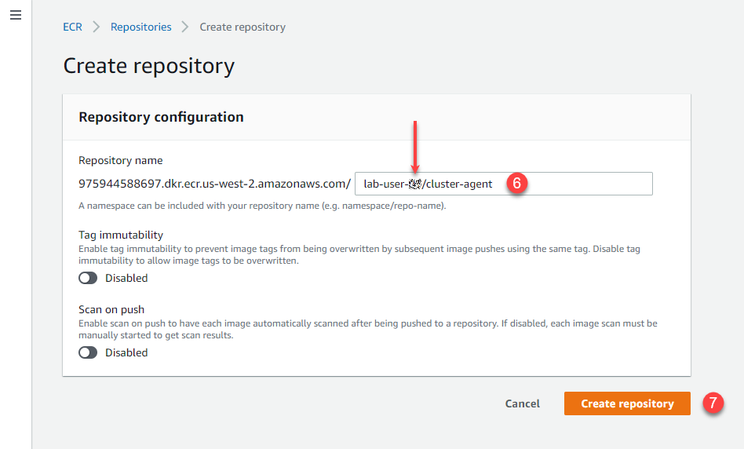
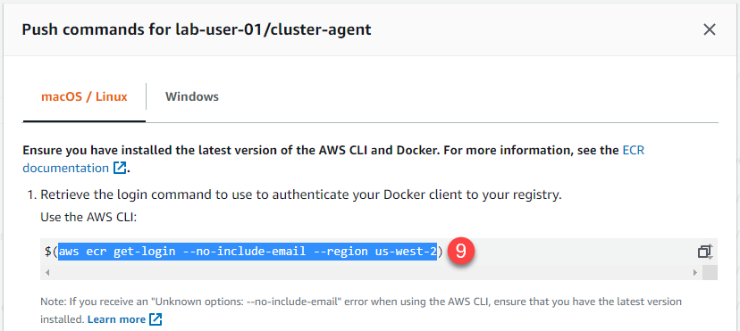
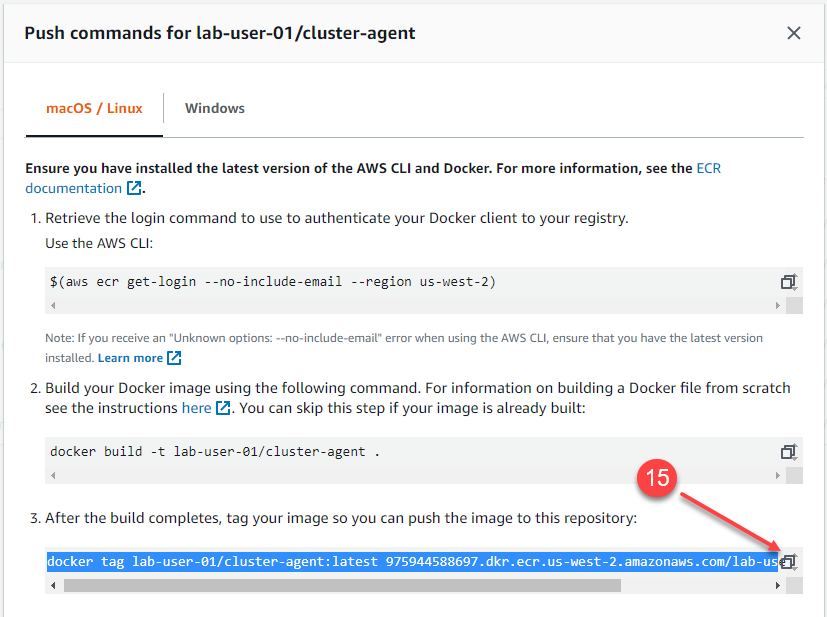
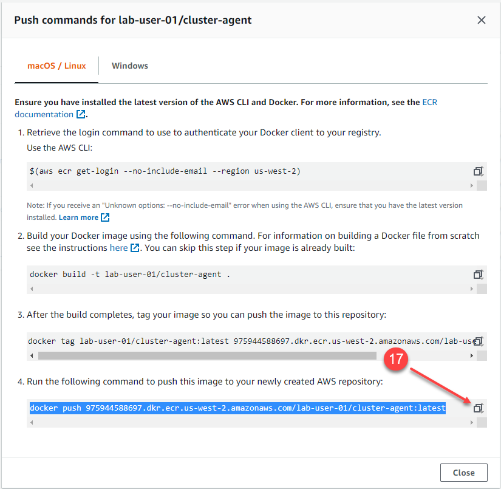

## Build your own Cluster Agent Docker image in AWS ECR

These instructions for building your own Cluster Agent Docker image in AWS ECR are for reference only and not intended to be part of the instructor led lab.  If you are participating in an instructor led lab, please use the pre-built Cluster Agent Docker image referenced [here](lab-exercise-06.md#2-build-the-cluster-agent-docker-image).

Use your [AWS Management Console](https://aws.amazon.com/console/) and follow the steps below to create a Docker repository in AWS ECR within your region:

1. Click on the "Services" link at the top left of the console
2. Type in "ECR" into the search box
3. Click on the first entry named "ECR"


<br><br>

4. Click on "Repositories" on the left
5. Click on the "Create repository" button on the top right


<br><br>

6. Enter the name of your repository as seen in the image below and use your specific lab user number where the red arrow is pointing to, so you **ensure that your repository name is unique**.  For example, if your lab user name is "Lab-User-01" then your repository name would be "lab-user-01/cluster-agent"
7. Click on the "Create repository" button on the bottom right


<br><br>

8. Now click on the "View push commands" button on the top right 


<br><br>

9. Highlight the login command as seen in the image below, then copy and paste it into your SSH terminal window 


<br><br>

10. Once you have pasted the command into the terminal window and executed the command, you should see a large block of text that you need to highlight and copy as seen in the image below where the block of text has been highlighted in grey 


<br><br>

11. Now paste the large login command into the terminal window and execute the command. You should see the "Login Succeeded" as the final output of the command


<br><br>

12. Use the command below to change to the docker directory in your SSH terminal window

```
cd /home/centos/AppD-Cloud-Kickstart/applications/aws/AD-Capital-Kube/ClusterAgent/docker
```


<br><br>

13. Copy the docker build command highlighted in the image below and paste it into your SSH terminal window and execute the command


<br><br>


14. Once you have copied the docker build command into your SSH terminal window and executed it, you should see output like the image below.


<br><br>


15. Copy the docker tag command highlighted in the image below and paste it into your SSH terminal window and execute the command.


<br><br>


16. Once you have copied the docker tag command into your SSH terminal window and executed it, you can then execute the ``` docker images ``` command and should see output like the image below.


<br><br>


17. Copy the docker push command highlighted in the image below and paste it into your SSH terminal window and execute the command.


<br><br>

18. Once you have copied the docker push command into your SSH terminal window and executed it, you should see output like the image below.


<br><br>

19. Now drill into your Docker repository in the AWS Console, you should see your newly published image inside your repo.  Copy the Image URI of your new image and save it in a text file to use in the next section of the lab.


<br><br>

<br>